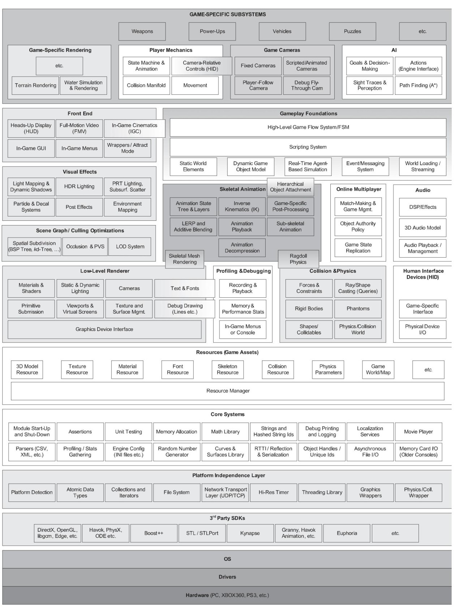

EchoEngine作为一个渲染引擎/游戏引擎项目，在软件设计时应该参考通用的渲染引擎/游戏引擎架构。《游戏引擎架构》（Game Engine Architecture）作为学习和研究渲染引擎/游戏引擎架构的经典书籍，其书中那张经典的「运行时引擎架构」图，必然成为我在设计EchoEngine时的参考。

从图上我们不难看出，一个优秀的游戏引擎由多个模块组合而成，比如：碰撞与物理模块、音频模块、GamePlay模块等等。下面将书中提到的部分重要模块进行归纳整理：

* 游戏引擎通常由工具套件和运行时组件构成
* 游戏引擎是由**软件层（software layer）**构建，并且通常为**上层依赖下层，而下层不依赖上层**。
* 引擎可分为一下几个模块

  * Hardware & Drivers
  * OS
  * 3rd Party SDKs
    :::note
    1. 第三方SDK是解决某一个问题或者某一类问题的通用解决方案。
    2. DirectX和OpenGL等图形API，可以让我们在CPU上通过特定的编程模式去操纵GPU。
    3. Havok、PhysX等物理引擎可以让我们高效准确地模拟物理过程，是虚拟世界运行的基础。
    4. Boost则是功能强大的数据结构和算法库，涵盖了大部分场景所需的数据结构和算法，方便我们快速构建更上层的逻辑，而不需要重新编写这些通用组件。
    5. STL是C++标准模板库，也包含了大量常用数据结构和算法。
    :::
  * Platform Independence Layer
    平台独立层包装了常用的标准C语言库、OS调用及其他基础API，确保包装了的接口在所有硬件平台上均为一致。
  * Core System
    :::note
    1. 断言（Asertion）：一种检查错误的代码。断言会插入代码中捕捉错误或找到与程序员原来假设不符的错误。
    2. 内存分配管理（Memory Allocation）：影响引擎运行期间创建和销毁各种对象的性能消耗。引擎在运行时会动态创建和销毁无数对象，如果管理不妥当，这些操作很容易成为性能瓶颈。
    3. 数学运算库（Math Library）：则决定了引擎中各种数学运算的性能。渲染、物理、动画等重要模块都重度依赖数学运算库。
    4. 异步文件IO（Asynchronous File IO）：则影响引擎读取资源文件的速度。游戏的运行依赖各种各样的资源文件，这些资源随时都有可能被使用到。
    :::
  * Game Asset
  * Render
    渲染层的设计一般采用*分层架构（layered architecture）*

    * **低阶渲染器（Low Level Renderer）**：包含引擎中全部原始的渲染功能，设计着重于告诉渲染丰富的几何图元（geometric primitive）。这个部分主要完成两个事情：
    :::note
    1. 抽象图形设备接口，以屏蔽不同的渲染API的差异。注意这里与Platform Independence Layer的差异。相比前者，这里的抽象难度个人感觉是更加复杂的，原因在于像DirectX、OpenGL这样的图像API，他们的设计思路和数据结构差异都比较大，想要很好地抽象这部分接口，需要对它们都有比较深刻的理解和经验。另外，近年来出现了vulkan这种高性能跨平台的图形API，能较好的在各个平台上运行，或许能帮我们处理这部分问题。
    2. 实现一些低阶的渲染功能，包括材质系统、光照系统、摄像机系统、调试渲染功能等。这些系统和功能属于渲染中比较底层的位置，是其他高阶系统实现的基础。实现这些系统，一方面要考虑运行时的效率，避免这些功能称为渲染的瓶颈。另一方面还要考虑这些系统对应的工具链，例如为材质系统提供好用的材质编辑器。
    :::
  * 场景图/剔除优化：粒子系统、光照贴图、环境贴图、全屏后处理、全屏抗锯齿等视觉效果
  * Front End-前端：呈现给用户/玩家的相关设备、界面、工具等
  * Profile & Debugging-性能剖析和调试
  * Collision & Physics-碰撞和物理
  * Animation-动画
  * Audio-音频
  * GamePlay Foundation-游戏性基础

    > 现代游戏引擎基本上都会有Script System这个概念，指的是在游戏引擎中嵌入脚本语言运行时环境，使得上层游戏逻辑可以使用脚本语言进行开发。这样做会来带几个好处：
    >
    > 1. 提高开发效率。脚本语言大多采用动态语言，例如Python，Lua等。这些语言描述的逻辑不需要经过预先编译，可以在运行时动态地由虚拟机进行解释和执行。如果游戏逻辑大多用这些脚本语言进行开发，那么开发人员在调整游戏逻辑的时候，只需要重新加载对应的代码资源即可，不需要再次编译，甚至不需要重新启动游戏，直接使用游戏内的重新加载功能。
    > 2. 保护游戏逻辑。由于多了虚拟机这一层概念，我们可以在虚拟机执行的过程中加入一些自定义的混淆和保护，加大了恶意破解的难度。例如Python这种语言，会在运行时把源码解释成字节码。那么可以根据一定规则对这些字节码重新进行混淆操作，使得恶意破解难以猜测原有逻辑。
    >
  * Game Specific Subsystems-游戏特定子系统

---

## 参考

[1] [The Cherno Game Engine Series](https://www.youtube.com/playlist?list=PLlrATfBNZ98dC-V-N3m0Go4deliWHPFwT)

[2] 《Game Engine Architecture, Second Edition》 Jason Gregory
